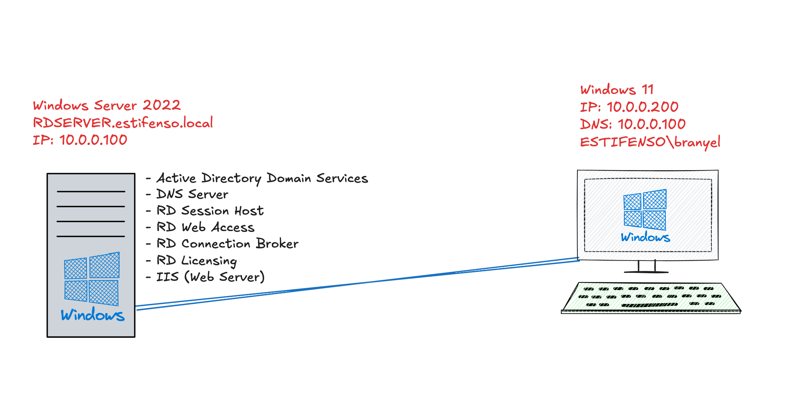

# Laboratorio RDS RemoteAPP con Active Directory

**Institución:** Instituto Tecnológico De Las Américas — ITLA  
**Asignatura:** Seguridad de Redes  
**Profesor:** Jonathan Rondón  
**Estudiante:** Branyel Perez — Matrícula: 2024-1489

---

## Descripción

Implementación completa de un laboratorio de **Remote Desktop Services (RDS) con RemoteAPP** sobre Windows Server 2022, integrado con Active Directory Domain Services. El objetivo es publicar aplicaciones de forma remota accesibles desde un cliente Windows 11 mediante el portal **RD Web Client**, sin necesidad de instalar clientes RDP adicionales.

---

## Topología de Red

```
MacBook Pro 2019 i9 — VMware Fusion
│
├── Windows Server 2022 (RDSERVER)
│   IP: 10.0.0.100
│   Roles: AD DS | DNS | RDS | IIS
│   Dominio: estifenso.local
│
└── Windows 11 (Cliente)
    IP: 10.0.0.200
    DNS: 10.0.0.100
    Usuario: ESTIFENSO\branyel
```



---

## Índice

1. [Infraestructura y Dominio Active Directory](#1-infraestructura-y-dominio-active-directory)
2. [Instalación de Roles Remote Desktop Services](#2-instalación-de-roles-remote-desktop-services)
3. [RemoteAPP Programs — Aplicaciones Publicadas](#3-remoteapp-programs--aplicaciones-publicadas)
4. [IIS — Página Web Personalizada](#4-iis--página-web-personalizada)
5. [Certificado SSL Autofirmado](#5-certificado-ssl-autofirmado)
6. [RD Web Client — Acceso desde el Cliente](#6-rd-web-client--acceso-desde-el-cliente)
7. [Work Resources — Apps Disponibles](#7-work-resources--apps-disponibles-en-el-cliente)
8. [Resultado Final](#8-resultado-final--remoteapp-en-el-cliente)
9. [Comandos Clave Utilizados](#comandos-clave-utilizados)

---

## 1. Infraestructura y Dominio Active Directory

El servidor Windows Server 2022 fue configurado como **Domain Controller (DC)** del dominio `estifenso.local`.

**Pasos realizados:**
- Renombrar el servidor a `RDSERVER`
- Asignar IP estática `10.0.0.100`
- Instalar el rol **Active Directory Domain Services (AD DS)**
- Promover el servidor a Domain Controller con el comando `Install-ADDSForest`
- Verificar el dominio con `Get-ADDomain`

```powershell
# Crear el bosque de dominio
Install-ADDSForest `
    -DomainName "estifenso.local" `
    -DomainNetbiosName "ESTIFENSO" `
    -InstallDns:$true `
    -Force:$true
```

> El servidor actúa como **PDC Emulator**, **RID Master**, **Infrastructure Master**, **Schema Master** y **Domain Naming Master** — todos los roles FSMO en un único DC de laboratorio.


*`Get-ADDomain` confirmando la creación exitosa del dominio `estifenso.local` con NetBIOS `ESTIFENSO`. `RDSERVER.estifenso.local` figura como PDC Emulator e Infrastructure Master.*

---

## 2. Instalación de Roles Remote Desktop Services

Se instalaron los cuatro componentes principales de **Remote Desktop Services (RDS)** en el mismo servidor mediante PowerShell.

| Rol | Función |
|-----|---------|
| **RD Session Host** | Aloja las sesiones remotas y ejecuta las RemoteAPPs |
| **RD Web Access** | Portal web HTTPS para acceder a las aplicaciones publicadas |
| **RD Connection Broker** | Gestiona y balancea las conexiones RDP entrantes |
| **RD Licensing** | Administra las licencias de acceso cliente (CAL) |

```powershell
# Instalar todos los roles RDS con herramientas de administración
Install-WindowsFeature -Name RDS-RD-Server, RDS-Web-Access, RDS-Connection-Broker, RDS-Licensing `
    -IncludeManagementTools

# Crear el deployment RDS
New-RDSessionDeployment `
    -ConnectionBroker "RDSERVER.estifenso.local" `
    -WebAccessServer "RDSERVER.estifenso.local" `
    -SessionHost "RDSERVER.estifenso.local"

# Crear la colección de sesiones
New-RDSessionCollection `
    -CollectionName "RDCollection" `
    -SessionHost "RDSERVER.estifenso.local" `
    -ConnectionBroker "RDSERVER.estifenso.local"
```


*Vista del deployment RDS en Server Manager con los tres roles activos: **RD Connection Broker**, **RD Session Host** y **RD Web Access**, todos corriendo en `RDSERVER.ESTIFENSO.LOCAL`.*

---

## 3. RemoteAPP Programs — Aplicaciones Publicadas

Se publicaron dos aplicaciones RemoteAPP dentro de la colección `RDCollection`, disponibles para todos los usuarios del grupo `ESTIFENSO\Domain Users`.

| Nombre en portal | Alias | Ejecutable | Argumento |
|------------------|-------|-----------|-----------|
| Portal Estifenso | `mstsc` | `mstsc.exe` | — |
| Portal Web Estifenso | `msedge` | `msedge.exe` | `http://localhost` |

```powershell
# Publicar Remote Desktop Connection
New-RDRemoteApp `
    -CollectionName "RDCollection" `
    -DisplayName "Portal Estifenso" `
    -FilePath "C:\Windows\System32\mstsc.exe" `
    -ConnectionBroker "RDSERVER.estifenso.local"

# Publicar Microsoft Edge apuntando al IIS local
New-RDRemoteApp `
    -CollectionName "RDCollection" `
    -DisplayName "Portal Web Estifenso" `
    -FilePath "C:\Program Files (x86)\Microsoft\Edge\Application\msedge.exe" `
    -CommandLineSetting Require `
    -RequiredCommandLine "http://localhost" `
    -ConnectionBroker "RDSERVER.estifenso.local"
```


*Server Manager mostrando la colección `RDCollection` con las dos RemoteAPPs publicadas y sesiones activas del **Administrator** y del usuario **branyel**.*

---

## 4. IIS — Página Web Personalizada

Se configuró **Internet Information Services (IIS)** con una página HTML personalizada que simula un portal de seguridad corporativo. Esta página es la que se sirve cuando la RemoteAPP "Portal Web Estifenso" (Edge) conecta a `http://localhost`.

**Ubicación del archivo:** `C:\inetpub\wwwroot\index.html`

La página muestra en tiempo real el estado de los servicios del servidor:
- Remote Desktop Services
- Active Directory Domain Services
- Internet Information Services

```powershell
# Instalar IIS con herramientas de administración
Install-WindowsFeature -Name Web-Server -IncludeManagementTools

# Verificar que IIS está activo
Get-Service -Name W3SVC
```


*Portal **"ESTIFENSO :: SECURE PORTAL"** sirviendo desde IIS en el servidor, mostrando el estado de todos los servicios RDS, AD DS e IIS en tiempo real con estética de terminal.*

---

## 5. Certificado SSL Autofirmado

Se generó un certificado SSL autofirmado para `RDSERVER.estifenso.local` y se aplicó a los roles **RD Web Access** y **RD Connection Broker**. El certificado fue exportado como `rdbroker.cer` para ser importado en los clientes y eliminar la advertencia de seguridad del navegador.

```powershell
# Generar certificado autofirmado
$cert = New-SelfSignedCertificate `
    -DnsName "RDSERVER.estifenso.local" `
    -CertStoreLocation "Cert:\LocalMachine\My" `
    -KeyUsage DigitalSignature, KeyEncipherment `
    -FriendlyName "RDS RemoteAPP Cert"

# Aplicar el certificado al RD Connection Broker
Set-RDCertificate `
    -Role RDRedirector `
    -ImportPath "Cert:\LocalMachine\My\$($cert.Thumbprint)" `
    -ConnectionBroker "RDSERVER.estifenso.local" `
    -Force

# Exportar el certificado para los clientes
Export-Certificate `
    -Cert "Cert:\LocalMachine\My\$($cert.Thumbprint)" `
    -FilePath "C:\inetpub\wwwroot\rdbroker.cer"
```

**Thumbprint:** `0C45C3911835CF8B28CD56E12A6A153FEA3EED76`  
**Descarga del certificado:** `http://10.0.0.100/rdbroker.cer`

> **Nota:** En producción se utilizaría un certificado emitido por una CA corporativa (AD CS) o una CA pública (Let's Encrypt, DigiCert). El certificado autofirmado es suficiente para entornos de laboratorio.

**Importar el certificado en Windows 11 (cliente):**
1. Descargar `http://10.0.0.100/rdbroker.cer`
2. Doble clic → *Install Certificate*
3. Store Location: **Local Machine**
4. Place all certificates in: **Trusted Root Certification Authorities**
5. Finish → reiniciar el navegador


*Listado de certificados en `Cert:\LocalMachine\My` mostrando los certificados generados para `RDSERVER.estifenso.local` con sus thumbprints.*

---

## 6. RD Web Client — Acceso desde el Cliente

Se instaló el **RD Web Client moderno** usando el módulo `RDWebClientManagement`. Este cliente basado en HTML5 permite acceder a las RemoteAPPs desde cualquier navegador sin instalar el cliente RDP tradicional.

**URL de acceso:**
```
https://RDSERVER.estifenso.local/RDWeb/webclient/
```

```powershell
# Instalar el módulo de gestión del Web Client
Install-Module -Name RDWebClientManagement -Force -AcceptLicense
Import-Module RDWebClientManagement

# Descargar e instalar el paquete del Web Client
Install-RDWebClientPackage

# Importar el certificado al Web Client
Import-RDWebClientBrokerCert -Path "C:\inetpub\wwwroot\rdbroker.cer"

# Publicar el Web Client en producción
Publish-RDWebClientPackage -Type Production -Latest
```


*Pantalla de login del RD Web Client moderno desde el cliente Windows 11. El usuario `ESTIFENSO\branyel` se autentica contra el dominio Active Directory.*

---

## 7. Work Resources — Apps Disponibles en el Cliente

Tras autenticarse en el RD Web Client, el usuario `branyel` tiene acceso al catálogo de aplicaciones publicadas en el servidor. No se requiere ningún software adicional en el cliente — todo corre en el servidor y se transmite vía RDP al navegador.


*Portal RD Web Client mostrando las dos aplicaciones disponibles para el usuario `branyel`:*
- ***Portal Estifenso*** *(mstsc) — Remote Desktop Connection*
- ***Portal Web Estifenso*** *(Edge apuntando a IIS) — listas para ser lanzadas remotamente desde el navegador*

---

## 8. Resultado Final — RemoteAPP en el Cliente

Al hacer clic en **"Portal Web Estifenso"**, el servidor lanza Microsoft Edge apuntando al IIS local (`http://localhost`) y transmite la ventana al cliente Windows 11 mediante el protocolo RDP a través del Web Client. El resultado es la página personalizada de IIS renderizándose en el cliente sin que Edge esté instalado localmente.

**Flujo completo:**

```
Cliente Windows 11 (branyel)
    │
    │ HTTPS (RDP over WebSocket)
    ▼
RD Web Client → RD Connection Broker → RD Session Host
                                            │
                                            │ Ejecuta msedge.exe → http://localhost (IIS)
                                            ▼
                                    Renderiza en el cliente
```


*Resultado final: el cliente Windows 11 visualiza el **"ESTIFENSO :: SECURE PORTAL"** a través de la RemoteAPP "Portal Web Estifenso", ejecutándose en el servidor pero renderizándose en el navegador del cliente mediante RDP RemoteAPP.*

---

## Comandos Clave Utilizados

> Los comandos presentados a continuación son un resumen consolidado de todo el proceso ejecutado vía PowerShell. Se optó por este formato en lugar de capturas individuales por cada comando, ya que documentar cada paso desde la GUI manualmente requeriría un volumen excesivo de imágenes. Todos los comandos son **100% funcionales** y pueden ser ejecutados en cualquier entorno Windows Server 2022 siguiendo el mismo orden.

```powershell
# ── ACTIVE DIRECTORY ──────────────────────────────────────────────────────────
Install-ADDSForest -DomainName "estifenso.local" -DomainNetbiosName "ESTIFENSO" `
    -InstallDns:$true -Force:$true

Get-ADDomain

# ── ROLES RDS ─────────────────────────────────────────────────────────────────
Install-WindowsFeature -Name RDS-RD-Server, RDS-Web-Access, RDS-Connection-Broker, `
    RDS-Licensing -IncludeManagementTools

New-RDSessionDeployment -ConnectionBroker "RDSERVER.estifenso.local" `
    -WebAccessServer "RDSERVER.estifenso.local" -SessionHost "RDSERVER.estifenso.local"

New-RDSessionCollection -CollectionName "RDCollection" `
    -SessionHost "RDSERVER.estifenso.local" -ConnectionBroker "RDSERVER.estifenso.local"

# ── REMOTEAPP ─────────────────────────────────────────────────────────────────
New-RDRemoteApp -CollectionName "RDCollection" -DisplayName "Portal Estifenso" `
    -FilePath "C:\Windows\System32\mstsc.exe" -ConnectionBroker "RDSERVER.estifenso.local"

New-RDRemoteApp -CollectionName "RDCollection" -DisplayName "Portal Web Estifenso" `
    -FilePath "C:\Program Files (x86)\Microsoft\Edge\Application\msedge.exe" `
    -CommandLineSetting Require -RequiredCommandLine "http://localhost" `
    -ConnectionBroker "RDSERVER.estifenso.local"

# ── IIS ───────────────────────────────────────────────────────────────────────
Install-WindowsFeature -Name Web-Server -IncludeManagementTools

# ── CERTIFICADO ───────────────────────────────────────────────────────────────
$cert = New-SelfSignedCertificate -DnsName "RDSERVER.estifenso.local" `
    -CertStoreLocation "Cert:\LocalMachine\My"

Export-Certificate -Cert "Cert:\LocalMachine\My\$($cert.Thumbprint)" `
    -FilePath "C:\inetpub\wwwroot\rdbroker.cer"

# ── RD WEB CLIENT ─────────────────────────────────────────────────────────────
Install-Module -Name RDWebClientManagement -Force -AcceptLicense
Import-Module RDWebClientManagement
Install-RDWebClientPackage
Import-RDWebClientBrokerCert -Path "C:\inetpub\wwwroot\rdbroker.cer"
Publish-RDWebClientPackage -Type Production -Latest
```

---

## Accesos del Laboratorio

| Recurso | URL / Valor |
|---------|-------------|
| RD Web Access | `https://RDSERVER.estifenso.local/RDWeb` |
| RD Web Client | `https://RDSERVER.estifenso.local/RDWeb/webclient/` |
| Portal IIS | `http://10.0.0.100` |
| Certificado | `http://10.0.0.100/rdbroker.cer` |
| Thumbprint cert | `0C45C3911835CF8B28CD56E12A6A153FEA3EED76` |

---

## Tecnologías Utilizadas


---

*Laboratorio realizado para la asignatura **Seguridad de Redes** — ITLA*
